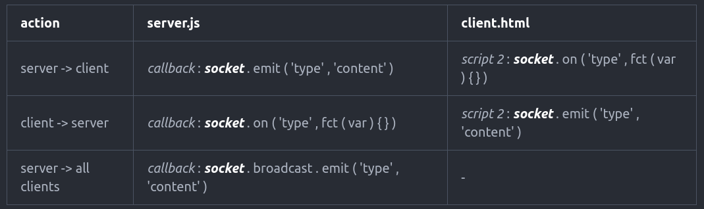

# Parcours_NodeJS
----------

## socket.io

* ### server.js
  * var io = require('socket.io').listen(server);
  * io.sockets.on( 'connection', *callback*(*__socket__*) {} );

* ### client.html
  * script 1 : src = '/socket.io/socket.io.js'
  * *script 2* : var *__socket__* = io.connect('http://localhost:8080')  

_______________
